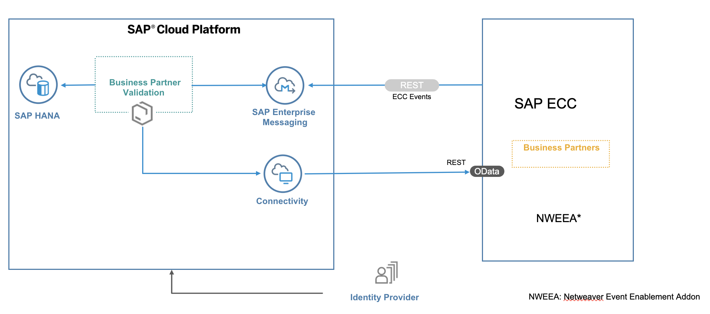

# ECC Extend Business Process Scenario

## Description
The main intent of this scenario is to complement an existing business process in an SAP solution – currently SAP ECC (ERP Central Component) - with additional business process steps. This involves adding major logic and/or additional data and goes beyond simple UI changes.

Detailed steps of the S/4 HANA on premise Extension Scenario can be found [here]( https://github.com/SAP-samples/cloud-extension-s4hana-business-process)

This application showcases:

- Building application on SAP Cloud Platform using SAP Cloud Application Programming Model (CAP)
- Consuming Events from SAP ECC using SAP CP Enterprise Messaging
- Consuming REST API's from SAP ECC using SAP CP Connectivity Service

## Business Scenario

A business scenario is used to showcase how to build a SAP ECC extension Application.

As an employee of Business Partner Validation Firm iCredible, which is a third-party vendor of ACME Corporation, John would like to get notifications whenever new Business Partners are added in SAP ECC backend system of ACME Corporation. John would then be able to review the Business Partner details in his extension app. He would proceed to visit the Business Partner’s registered office and do some background verification. John would then proceed to update/validate the verification details into the extension app. Once the details are verified, the Business Partner gets activated in the SAP ECC system of ACME Corporation.

- Custom extension application that works independently from SAP ECC

- Changes in SAP ECC communicated via events in real time to extension application. 

- Compute intensive batch processing available on demand (serverless environment) 

- Vendor personnel needs access to only custom app

## Architecture

### Solution Diagram



The Business Partner Validation application is developed using [SAP Cloud Application programming Model (CAP)](https://cap.cloud.sap/docs/) and runs on the SAP Cloud Platform Cloud Foundry Environment. It consumes platform services like Enterprise Messaging, SAP HANA and Connectivity. The events generated in SAP ECC are inserted into the Enterprise messaging queue. The application running in Cloud Foundry polls the queue for these messages and inserts them into the HANA database. It uses SAP ECC REST API's to read Business Partner Data from SAP ECC system. It also updates the address and removes central block on the Business Partner once verified. 

## Requirements
* SAP ECC on premise system.
* SAP Cloud Platform account with [Enterprise Messaging](https://help.sap.com/viewer/product/SAP_ENTERPRISE_MESSAGING/Cloud/en-US) service. The 'default' plan for Enterprise Messaging service is required.

### For local development you would require the following:
* [Node js](https://nodejs.org/en/download/)
* [Cloud Foundry Command Line Interface (CLI)](https://github.com/cloudfoundry/cli#downloads)
* [Visual Studio Code](https://cap.cloud.sap/docs/get-started/in-vscode)
* [cds-dk](https://cap.cloud.sap/docs/get-started/)
* [SQLite ](https://sqlite.org/download.html)
* To build the multi target application, we need the [Cloud MTA Build tool](https://sap.github.io/cloud-mta-build-tool/), download the tool from [here](https://sap.github.io/cloud-mta-build-tool/download/)
* For Windows system, install 'MAKE' from https://sap.github.io/cloud-mta-build-tool/makefile/
>Note: Please set the npm registry for @sap libraries using the command :  
`npm set @sap:registry=https://npm.sap.com`
* [multiapps plugin](https://github.com/cloudfoundry-incubator/multiapps-cli-plugin) - `cf install-plugin multiapps`  
*  mbt -  `npm install -g mbt`

## Configuration

### Entitlements

The application requires below set of SAP Cloud Platform Entitlements/Quota

| Service                           | Plan       | Number of Instances |
|-----------------------------------|------------|:-------------------:|
| Enterprise Messaging              | default    |          1          |
| SAP HANA Schemas & HDI Containers | hdi-shared |          1          |
| SAP Hana Service                  | 64standard |          1          |
| Application Runtime               |            |          3          |


### Project Structure

The project contains below folders and files

File / Folder | Purpose
---------|----------
`app/` | content for UI frontends go here
`db/` | your domain models and data go here
`srv/` | your service models and code go here
`package.json` | project metadata and configuration
`readme.md` | this getting started guide

#### Steps to deploy locally

- Open terminal in VSCode
- Run `cds watch`

#### Steps to deploy the application on Cloud Foundry

1. Build the application
    `mbt build -p=cf `  
2. Login to Cloud Foundry by typing the below commands on command prompt
    ```
    cf api <api>
    cf login -u <username> -p <password>
    ```
    `api` - [URL of the Cloud Foundry landscape](https://help.sap.com/viewer/65de2977205c403bbc107264b8eccf4b/Cloud/en-US/350356d1dc314d3199dca15bd2ab9b0e.html) that you are trying to connect to.

    Select the org and space when prompted to.

3. Deploy the application

	Navigate to mta_archives folder and run the below command from CLI

   `cf deploy BusinessPartnerValidation_1.0.0.mtar`

## Demo script

1. In the command line interface run the command `cf apps`
   
2. Find the URL for the app ` BusinessPartnerValidation-ui` - this is the launch URL for the Business Partner Validation application.

3. Launch the URL in a browser.

4. Click on Business Partner Validation tile


5. The list of BusinessPartners along with their verification status gets displayed. 


6. Login to the SAP ECC system


7. Enter transaction code 'bp'


8. Click on Person


9. Provide first name, last name for the business partner


10. Provide the address


11. Move to the status tab and check mark the 'Central Block' lock. Save the BP. This will create a new Business Partner 


12. Now go back to the BusinessPartnerValidation application to see if the new BusinessPartners has come on the UI


13. Go to the details page for the new BusinessPartner. Click on edit.


14. Change the Verification Status to VERIFIED. You can also edit the street name, postal code also if needed. Save the data. 


15. Open SAP ECC system, bp transaction. Search for the newly created bp


16. Double click on the BP


17. You can see that the central Block lock has been removed 


18. You can also notice that in the BusinessPartner Validation UI, the status is now set as COMPLETED.

## Known Issues

No known issues.

## How to Obtain Support

In case you find a bug, or you need additional support, please open an issue here in GitHub.

## License
Copyright (c) 2020 SAP SE or an SAP affiliate company. All rights reserved. This project is licensed under the Apache Software License, version 2.0 except as noted otherwise in the [LICENSE](LICENSES/Apache-2.0.txt) file.

